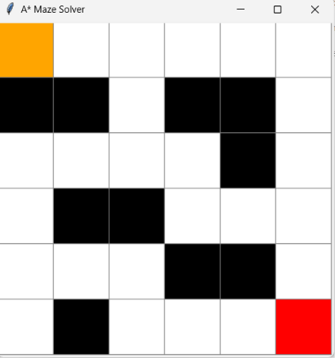
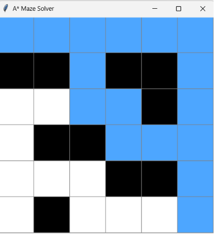
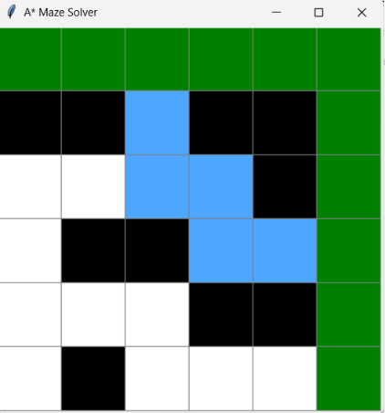

# A* Maze Solver and Pathfinding Visualizer

## Overview

A Python-based visualization of the A* (A-Star) Search Algorithm used to find the shortest path in a grid-based maze. The project demonstrates fundamental Artificial Intelligence search techniques by visualizing node exploration and optimal path generation using heuristic-based pathfinding.

This project was developed as part of an Artificial Intelligence case study.

## Features

* A* Search Algorithm implementation
* Manhattan Distance heuristic
* Animated visualization of node exploration
* Optimal path reconstruction
* Grid-based maze representation
* Interactive GUI using Tkinter
* Color-coded search process

## Technologies Used

* Python
* Tkinter
* `heapq` (Priority Queue)

## Algorithm

A* is an informed search algorithm that combines the actual cost of reaching a node with an estimated cost of reaching the goal.

* **g(n)** – Actual cost from the start node to the current node
* **h(n)** – Estimated cost from the current node to the goal node

The evaluation function is:

```text
f(n) = g(n) + h(n)
```

The heuristic used in this project is the Manhattan Distance:

```text
h(n) = |x₁ − x₂| + |y₁ − y₂|
```

By combining actual and estimated costs, A* efficiently finds the shortest path while exploring promising nodes based on their estimated total cost.

## Visualization Legend

| Color     | Description     |
| --------- | --------------- |
| 🟧 Orange | Start Node      |
| 🟥 Red    | Goal Node       |
| ⬛ Black   | Wall / Obstacle |
| 🟦 Blue   | Explored Nodes  |
| 🟩 Green  | Optimal Path    |
| ⬜ White   | Unvisited Cells |

## Project Highlights

* Implemented the A* Search Algorithm from scratch
* Utilized the Manhattan Distance heuristic for pathfinding
* Visualized node exploration and path reconstruction
* Demonstrated heuristic-based Artificial Intelligence search techniques
* Built an interactive graphical interface using Tkinter
* Used a Priority Queue to efficiently select the next node for exploration

## Screenshots

### Initial Maze



### Explored Nodes



### Final Optimal Path



## Project Structure

```text
maze-solver-ai-project/
│
├── maze_solver.py
├── README.md
└── screenshots/
    ├── start.png
    ├── explored.png
    └── finalpath.png
```

## How to Run

### Clone the Repository

```bash
git clone https://github.com/srijay-095/maze-solver-ai-project.git
cd maze-solver-ai-project
```

### Run the Application

```bash
python maze_solver.py
```

## Learning Outcomes

This project provided practical understanding of:

* Artificial Intelligence search techniques
* Heuristic-based pathfinding
* Graph traversal concepts
* Priority Queue implementation
* Path reconstruction
* GUI development using Tkinter
* Visualization and animation of search algorithms

## Future Enhancements

* Random maze generation
* Interactive obstacle placement
* BFS (Breadth-First Search)
* DFS (Depth-First Search)
* Dijkstra's Algorithm
* Comparison of different search algorithms
* Performance metrics such as execution time, nodes explored, and path length

## Author

### Banda Srijay Ram Reddy

Computer Science Engineering (AI & ML)

* GitHub: https://github.com/srijay-095
* LinkedIn: https://www.linkedin.com/in/srijay-ram-reddy-802580376/
* LeetCode: https://leetcode.com/u/srijay95/
